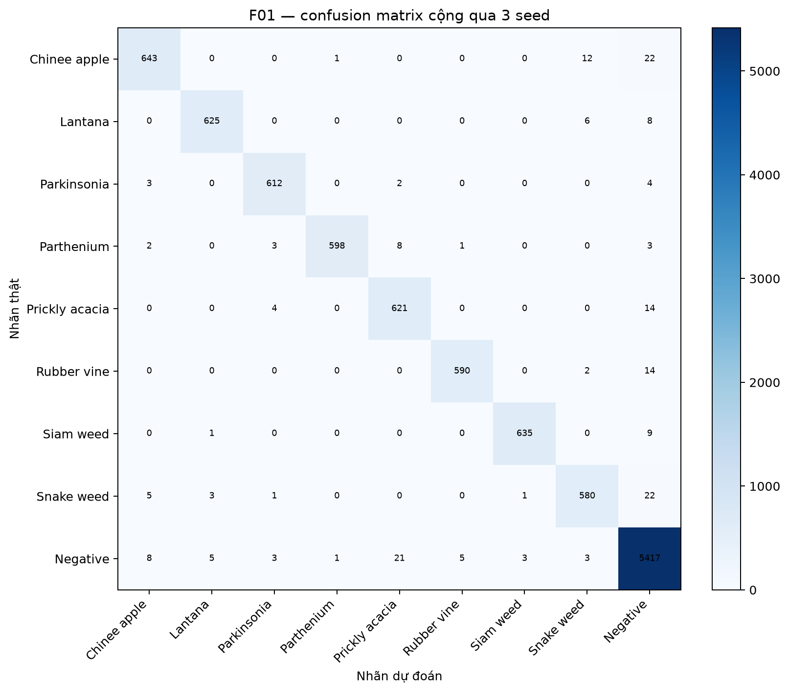

# Báo cáo DeepWeeds — Lab Day 2

## Tóm tắt

Cấu hình F01 đạt macro-F1 test **0.9761 ± 0.0040** và top-1 test
**0.9810 ± 0.0029** qua 3 seed. So với mốc T00, macro-F1 thay đổi
**+0.1287**. Các số liệu được tính lại trực tiếp từ `predictions/` bằng `eval.py`.

## Dữ liệu và thiết lập

- DeepWeeds, fold 0 cố định; không gộp validation vào train.
- Validation dùng để chọn backbone, recipe, checkpoint, inference và temperature.
- Test chỉ chạy một lần cho từng seed sau khi cấu hình và inference spec đã đóng băng.
- Seed chung kết: 42, 123, 2026.
- Notebook tái lập: https://colab.research.google.com/github/duongduong1606/K4-Track4-Day2-Deeplearning-Advance/blob/main/code/lab_day2.ipynb

## Kết quả chung kết

| Cấu hình | Macro-F1 test | Top-1 test | ECE test |
|---|---:|---:|---:|
| T00 | 0.8475 ± 0.0010 | 0.8842 ± 0.0012 | 0.0128 ± 0.0009 |
| F01 | 0.9761 ± 0.0040 | 0.9810 ± 0.0029 | 0.0090 ± 0.0002 |

## Kết quả thực nghiệm trên validation

### So sánh backbone

| Exp | Backbone | Macro-F1 val | Top-1 val | Params (M) | GMAC |
|---|---|---|---|---|---|
| B03 | convnext_tiny | 0.9673 | 0.9749 | 27.8270 | 4.4548 |
| B05 | swin_tiny_patch4_window7_224 | 0.9606 | 0.9714 | 27.5263 | 4.3711 |
| B04 | deit_small_patch16_224 | 0.9550 | 0.9674 | 21.6691 | 4.2408 |
| B06 | efficientnet_b0 | 0.8686 | 0.9000 | 4.0191 | 0.3846 |
| B02 | resnext50_32x4d | 0.8614 | 0.8952 | 22.9983 | 4.2862 |
| B01 | resnet50 | 0.8469 | 0.8843 | 23.5265 | 4.1317 |

### Ablation công thức huấn luyện

| Exp | Loss | Aug | Mix | Macro-F1 val | Top-1 val |
|---|---|---|---|---|---|
| T00 | ce | basic | None | 0.8469 | 0.8843 |
| T00 | ce | basic | None | 0.8462 | 0.8866 |
| T04 | ce | randaug | None | 0.8462 | 0.8837 |
| T05 | ls | basic | None | 0.8446 | 0.8855 |
| T06 | focal | basic | None | 0.8391 | 0.8777 |
| T00 | ce | basic | None | 0.8372 | 0.8809 |
| T09 | ce | basic | None | 0.8359 | 0.8772 |
| T03 | ce | color | None | 0.8270 | 0.8700 |
| T08 | ce | basic | cutmix | 0.8207 | 0.8640 |
| T07 | ce_weighted | basic | None | 0.8067 | 0.8289 |
| T02 | ce | basic | None | 0.6569 | 0.7532 |
| T01 | ce | basic | None | 0.5684 | 0.6881 |

### Suy luận và đánh đổi latency

| Method | Resolution | K | Aggregation | Macro-F1 val | ECE val | p95 (ms) |
|---|---:|---:|---|---:|---:|---:|
| I03 | 256 | 1 | prob | 0.9753 | 0.0101 | 432.99 |
| I04 | 288 | 1 | prob | 0.9707 | 0.0095 | 522.85 |
| I01 | 224 | 2 | prob | 0.9706 | 0.0123 | 686.47 |
| I02 | 224 | 2 | logit | 0.9706 | 0.0124 | 722.23 |
| I09 | 224 | 2 | prob | 0.9706 | 0.0070 | 725.91 |
| I00 | 224 | 1 | prob | 0.9673 | 0.0131 | 339.34 |
| I07 | 224 | 1 | prob | 0.9673 | 0.0070 | 341.87 |
| I03 | 256 | 1 | prob | 0.8767 | 0.0144 | 8.19 |
| I04 | 288 | 1 | prob | 0.8686 | 0.0134 | 9.53 |
| I02 | 224 | 2 | logit | 0.8583 | 0.0189 | 24.16 |
| I01 | 224 | 2 | prob | 0.8580 | 0.0285 | 18.73 |
| I09 | 224 | 2 | prob | 0.8580 | 0.0130 | 14.88 |
| I07 | 224 | 1 | prob | 0.8469 | 0.0137 | 6.67 |
| I00 | 224 | 1 | prob | 0.8469 | 0.0162 | 11.73 |

## Chỉ số từng lớp của F01

| Lớp | Recall mean ± std | F1 mean ± std |
|---|---:|---:|
| Chinee apple | 0.9484 ± 0.0068 | 0.9604 ± 0.0072 |
| Lantana | 0.9781 ± 0.0027 | 0.9819 ± 0.0027 |
| Parkinsonia | 0.9855 ± 0.0048 | 0.9839 ± 0.0013 |
| Parthenium | 0.9724 ± 0.0056 | 0.9844 ± 0.0057 |
| Prickly acacia | 0.9718 ± 0.0081 | 0.9621 ± 0.0069 |
| Rubber vine | 0.9736 ± 0.0057 | 0.9817 ± 0.0038 |
| Siam weed | 0.9845 ± 0.0054 | 0.9891 ± 0.0036 |
| Snake weed | 0.9477 ± 0.0158 | 0.9547 ± 0.0096 |
| Negative | 0.9910 ± 0.0018 | 0.9868 ± 0.0017 |

## Phân tích và kết luận

Các bảng trên được sinh trực tiếp từ log chạy thật. Khi diễn giải, chỉ coi một cải thiện là rõ ràng
nếu chênh lệch lớn hơn nhiễu giữa seed. Các file dự đoán sai cần được xem trực quan, đặc biệt cặp
Chinee Apple ↔ Snake Weed, trước khi đưa ra giả thuyết sinh học hoặc điều kiện chụp ảnh.

## Hạn chế

Kết quả dùng ba seed nhưng chỉ một fold. DeepWeeds được chia ngẫu nhiên, không theo địa điểm, nên
điểm test có thể lạc quan khi triển khai tại vùng, mùa hoặc điều kiện ánh sáng mới. Cần đánh giá
thêm dưới lệch phân phối và trên phần cứng robot mục tiêu.
